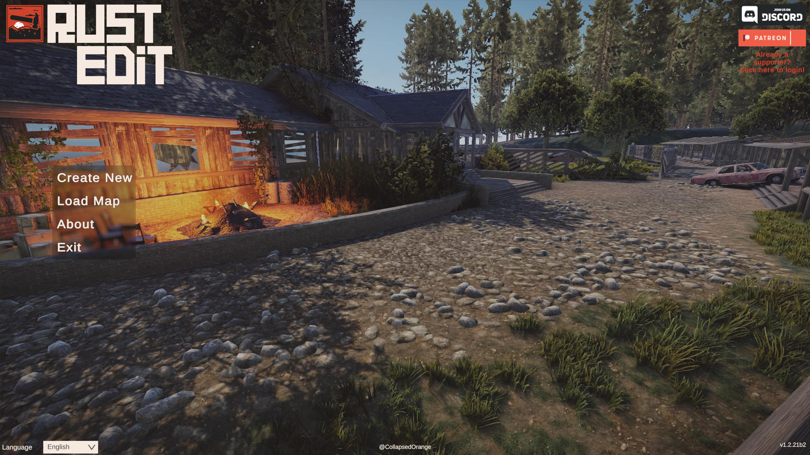

# Installing RustEdit

> **This page is a skeleton.** The structure is right; the specifics need
> filling in by someone who has done a clean install recently. Delete this note
> when it's done.

## Requirements

- Windows 10 or later.
- Rust installed through Steam.
- _TODO: minimum RAM, GPU notes, .NET or other runtime requirements._

## Download

_TODO: where the current release lives, and how to tell which version you have._

## First run

1. Extract the archive somewhere permanent - not your Downloads folder. The
   editor writes maps and settings beside itself.
2. Launch it.
3. Point it at your Rust installation when prompted.

_TODO: what the settings screen actually looks like, and which fields matter._

### Finding your Rust folder

In Steam, right-click Rust → Manage → Browse local files. The path Steam opens
is the one the editor wants.

## Verifying the install

The editor opens on its main menu:

Four options, a language selector in the bottom-left corner and the version
number in the bottom-right. Check the version against the download page - if it
doesn't match, you launched an older copy that's still lying around.

Getting this far only proves the editor runs. To prove it can read game content,
generate a small procedural map with **Create New** and let it load fully. If
terrain and prefabs both appear, the Rust folder is set correctly - which is the
part most installs get wrong.

If it doesn't, go to [Troubleshooting](troubleshooting.md) before changing
anything else.

## Updating

_TODO: whether updates are in-place or a fresh extract, and whether settings
and maps survive._

Back up your `Maps` folder before any update. It costs nothing and the one time
it matters, it matters a great deal.
