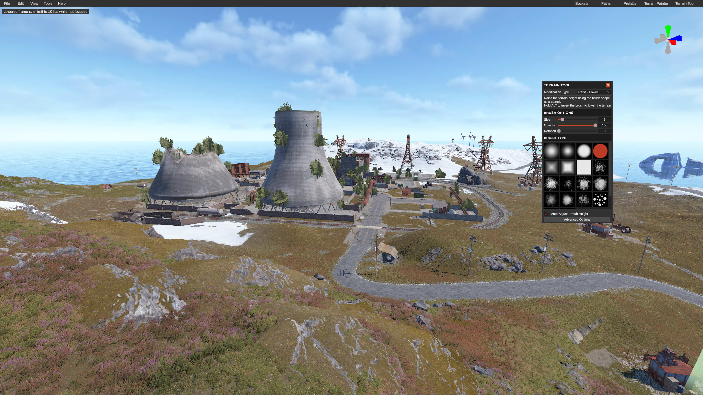

# Your First Map

> **This page is a skeleton.** The shape of the walkthrough is here; the exact
> menus and field names need someone with the editor open. Delete this note
> when it's done.

The goal is a full loop - generate, change one thing, save, load it in game -
rather than a good map. Do the loop first; the editing is the easy part.

## 1. Generate a base map

Start from a procedural map rather than empty terrain. You get working terrain,
biomes and roads to react to.

_TODO: the actual menu path, and what map size to suggest for a first attempt._

A smaller map loads faster, and you will be loading it many times.

## 2. Look around

That's the whole editor. Top-left are the menus - **File**, **Edit**, **View**,
**Tools**, **Help**. Top-right are the tools you'll actually live in:
**Sockets**, **Paths**, **Prefabs**, **Terrain Painter** and **Terrain Tool**.
Each opens a floating panel like the one on the right of the shot, and the
compass in the corner tells you which way you're facing.

Move the camera before you change anything, so you can tell later whether a
problem is yours.

| Action | Control |
| --- | --- |
| Move | _TODO_ |
| Look | _TODO_ |
| Faster / slower | _TODO_ |

## 3. Change one thing

Place a single prefab somewhere you'll recognise - a road junction, a hilltop.
One object, somewhere obvious.

_TODO: how to open the prefab browser and place something._

Resist doing more. The point of the first pass is proving the loop.

## 4. Save

Save as a `.map` file in the `Maps` folder.

_TODO: naming rules, and whether saving overwrites silently._

> Keep the procedural map you started from. When something goes wrong later,
> being able to diff against the original saves hours.

## 5. Load it

Start a local server with your map file and walk to the thing you placed.

_TODO: the server startup line, and where the map file must sit._

Seeing your one prefab in game means the whole chain works. Everything after
this is more of the same.

## What next

- [Working with Prefabs](prefabs.md) - placing things properly.
- [Troubleshooting](troubleshooting.md) - when a step above didn't do what it
  says.
